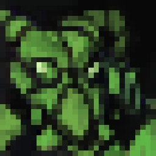
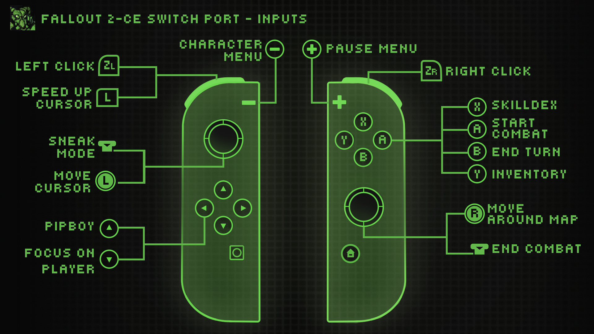

# Fallout 2 Community Edition - Switch

You must own the game to play and have a Switch capable of running **unsigned code, so you need a Switch running on custom firmware** to run the port. Needless to say, this is not an official effort from Interplay or Bethesda.

---

## Installation

1. Purchase your copy on [GOG](https://www.gog.com/game/fallout_2) or [Steam](https://store.steampowered.com/app/38410). The files need to be from a Windows installation (I think.)
2. Download the latest [release](https://github.com/ryandeering/fallout2-ce-switch/releases/latest) or build from the source. See YAML pipelines for reference.
3. Drag the installation files into a new folder called `fallout2` in your `switch` folder on the root of your SD card.
4. Put the necessary executable in your `switch` folder on the root of your SD card, either `.nro` or `.nso`.

> **Note:** Any Fallout 2 saves, CE or not, should work on this port. However, I'm not responsible if your save somehow corrupts!

## Controls

- **Basic touchscreen support is implemented.**
- **On-screen keyboard support implemented for names and saves.**

## Configuration

- **Resolution**: Not configurable at this time; values are hardcoded.
- **Cursor Sensitivity**: Adjustable in options via mouse sensitivity. Note this will affect cursor speedup as well.

## Issues

If you encounter any issues, please create an issue ticket, and I'll look into it when I have time. Other contributors are welcome to assist in solving and fixing issues if interested.

## Questions

- **Fallout 1 wen?**

> When I get some time 🙂

## Credits

- **Interplay**: For developing and publishing the original game.
- **alexbatalov and fallout2-CE Contributors**: For their excellent work in keeping this game modern.
- **Romane**: For the graphics.
- **Tiwaz and Caleb Orchard**: For testing.

Much appreciated to all.
